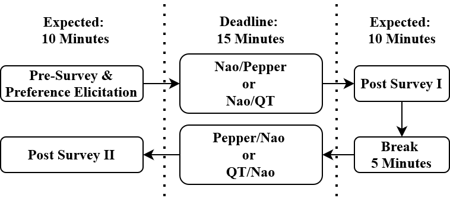

# You Look Nice, but I Am Here to Negotiate: The Influence of Robot Appearance on Negotiation Dynamics — [HRI 2024]

Mehmet Onur Keskin · Selen Akay · Ayşe Doğan · Berkecan Koçyiğit · Junko Kanero · Reyhan Aydoğan

[Paper](https://doi.org/10.1145/3610978.3640759) · [Explore the method](METHOD.md) · [Try the code](#try-it-yourself) · [Study guide](docs/protocol.md) · [Citation](#cite-the-paper)

[](https://github.com/monurkeskin/You-Look-Nice-but-I-Am-Here-to-Negotiate-HRI-2024/actions/workflows/tests.yml)
[](https://codecov.io/gh/monurkeskin/You-Look-Nice-but-I-Am-Here-to-Negotiate-HRI-2024)

People form impressions of a robot before it makes its first offer. **Do those
impressions carry into bargaining outcomes?** This paper studies holiday planning
with NAO, Pepper and QT, comparing negotiation scores with impressions and
post-interaction attitudes.

<p align="center">
  
  
  
</p>

*Figure 1: the three robot appearances. They were compared in two separate studies,
not in a single three-robot experiment.*

## Two studies with a common procedure



*Figure 2. Robot order is counterbalanced. Each negotiation has a fifteen-minute
deadline and is followed by a survey.*

| Study | Robot pair | Setting | Utility-analysis participants |
| --- | --- | --- | ---: |
| I | NAO / Pepper | Sabancı University | 52 |
| II | NAO / QT | Özyeğin University | 74 |

Before negotiating, people rank holiday issues and their possible values. The
agent receives a conflicting preference profile. Participants negotiate twice;
the paper's procedure changes destinations between sessions. Preference order,
robot order and cohort therefore belong in the study record.

## Appearance, warmth and negotiation scores

The paper reports differences in perceptions of the robots, but did not find
significant differences in **participants' utility scores** within either robot
pair. Table 2 provides the following means and standard deviations, on a 0–100
scale:

| Study / robot | Participant score, mean ± SD | Robot score, mean ± SD |
| --- | ---: | ---: |
| I / NAO | 72.43 ± 11.61 | 76.67 ± 7.82 |
| I / Pepper | 72.13 ± 13.12 | 77.64 ± 8.72 |
| II / NAO | 80.32 ± 9.41 | 71.07 ± 8.63 |
| II / QT | 81.93 ± 8.47 | 69.11 ± 8.20 |

In Study I, post-negotiation warmth was higher for NAO than Pepper
(68.40 vs. 57.44; $p=0.039$). In Study II, NAO was rated as more animate and
anthropomorphic than QT. These findings distinguish a person's experience of
the robot from the score they obtain. The nonsignificant utility comparisons
do not establish equivalence, and the two cohorts are not interchangeable.
[Paper Sections 3.3–3.4 and Table 2](https://doi.org/10.1145/3610978.3640759) ·
[Figure and result sources](docs/paper/README.md).

## What you can explore

Compare the two cohort configurations, inspect preference elicitation and review session records with robot order and domain identity preserved. The examples provide a starting point for studying appearance without mixing it with tactic changes.

| Explore | Start with | What it shows |
| --- | --- | --- |
| Separate cohorts | [CONFIGURATIONS.md](CONFIGURATIONS.md) | Choose NAO/Pepper or NAO/QT and the robot order. |
| Preference elicitation | [docs/protocol.md](docs/protocol.md) | Inspect participant ranking and conflicting robot preferences. |
| Interpretation | [docs/analysis.md](docs/analysis.md) | Keep domain, cohort and paired-session identity in the analysis. |

The configurations, method checks and study guides are specific to this paper. The shared [NEGOTIATOR framework](https://github.com/monurkeskin/NEGOTIATOR-IJCAI-2024) runs the negotiation,
participant/conductor views and session analysis. Its exact **2.1.0** revision is
pinned in [framework.json](framework.json); installation brings it in automatically.

The paper's holiday table and prose differ, and its illustrated weights differ from the legacy rank-to-weight conversion. The maintained configurations expose their choices in [METHOD.md](METHOD.md); they do not settle which files were used in each original cohort. Robot gestures and affect inputs also require the relevant lab setup.

## Try it yourself

Use Python 3.11 or 3.12 and Git. This first example runs locally without a robot,
camera or service account.

```bash
git clone https://github.com/monurkeskin/You-Look-Nice-but-I-Am-Here-to-Negotiate-HRI-2024.git
cd You-Look-Nice-but-I-Am-Here-to-Negotiate-HRI-2024
python3 -m venv .venv
source .venv/bin/activate
python -m pip install -r requirements.txt
python run.py --output demo-output
```

On Windows, create the environment with `py -3 -m venv .venv` and activate it with
`.venv\Scripts\Activate.ps1` in PowerShell.

Open **`demo-output/report/index.html`** to follow the example negotiation. The
output includes offers, utility trajectories, session records and exportable
figures. These are synthetic examples for exploring the software and method.
[Installation help](docs/compatibility.md).

### Read a calculation or open the study workspace

```bash
negotiator reproduce reproduction/method.json --output method-output
negotiator gui
```

In **New study → Import a paper or study configuration**, select
`configs/synthetic.json` for the demonstration, or `configs/protocol-nao-pepper-nao-first.json`
to inspect the paper's protocol template. The [study guide](docs/protocol.md)
explains the remaining protocol/asset requirements and device setup.

## Data and analysis

Participant records and recordings are not included. The examples use labeled
synthetic inputs so you can run the code and inspect its calculations. Recomputing
the human-study results requires authorized access to the original inputs and
the matching analysis procedure.

[Reproducibility guide](REPRODUCIBILITY.md) · [Paper-to-code map](paper-map.json) ·
[Analysis guide](docs/analysis.md)

## Build on the work

To change a paper condition, start with its configuration and add a small test
showing the intended behavior. Shared negotiation rules belong in NEGOTIATOR;
paper-specific profiles, protocols and result recipes belong here. The
[development guide](docs/development.md) walks through these boundaries and the
test-first workflow. [Contribution guide](CONTRIBUTING.md).

## Cite the paper

If you use this method or study design, please cite the associated paper:

```bibtex
@inproceedings{robotappearance2024,
  title = {You Look Nice, but I Am Here to Negotiate: The Influence of Robot Appearance on Negotiation Dynamics},
  author = {Keskin, Mehmet Onur and Akay, Selen and Doğan, Ayşe and Koçyiğit, Berkecan and Kanero, Junko and Aydoğan, Reyhan},
  year = {2024},
  doi = {10.1145/3610978.3640759},
  url = {https://doi.org/10.1145/3610978.3640759}
}
```

The [citation file](CITATION.cff) provides the paper as the preferred citation.
For software provenance, record the [2.1.0 release](https://github.com/monurkeskin/You-Look-Nice-but-I-Am-Here-to-Negotiate-HRI-2024/releases/tag/v2.1.0) and commit used. The earlier [archived 2.0.0 artifact](https://doi.org/10.5281/zenodo.22729006) remains available.
When using the shared engine in new research, cite the
[NEGOTIATOR framework paper](https://doi.org/10.24963/ijcai.2024/1012).
GPL-3.0-only; original contributors and sources are credited in [NOTICE](NOTICE).
