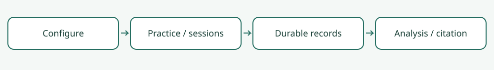

# You Look Nice, but I Am Here to Negotiate: The Influence of Robot Appearance on Negotiation Dynamics

[](https://doi.org/10.5281/zenodo.22729006)

**Independent research companion · maintained release 2.0.0**

[](https://github.com/monurkeskin/robot-appearance-2024/actions/workflows/tests.yml)
[Paper](https://doi.org/10.1145/3610978.3640759) · [Method](METHOD.md) · [Reproduce](REPRODUCIBILITY.md) · [Protocol](docs/protocol.md) · [Contribute](docs/development.md)

Solver-based negotiation with robot appearance varied separately in NAO/Pepper and NAO/QT cohorts.

This package contains this paper's configurations, method requirements, independent
checks and analysis recipes. It uses a pinned [NEGOTIATOR](https://github.com/monurkeskin/NEGOTIATOR)
engine; no second engine checkout or robot is needed for the first example.

| Start here | What you will get |
| --- | --- |
| First-time user | A short generated negotiation, session records and a readable report |
| Researcher reading the paper | [Paper map](paper-map.json), exact point tables where recovered, equation checks and result availability |
| Contributor | [Module boundaries and test-first example](docs/development.md), extensible configs and reusable engine contracts |

## Run your first example

Use Python 3.11 or 3.12. Clone this repository, then run:

```bash
git clone https://github.com/monurkeskin/robot-appearance-2024.git
cd robot-appearance-2024
python3 -m venv .venv
source .venv/bin/activate
python -m pip install -r requirements.txt
python run.py --output demo-output
```

On Windows, create the environment with `py -3 -m venv .venv` and activate it
with `.venv\Scripts\Activate.ps1` in PowerShell. Git is required for the pinned
engine dependency. [Troubleshooting and compatibility](docs/compatibility.md).

Open `demo-output/report/index.html`. The output includes full-precision JSON/CSV,
a workbook, figures, immutable source records and a timing receipt. This is a
**synthetic functional example**; it does not reproduce human participants or an
emotional, gesture or embodiment benefit. Existing output directories are preserved.



## Inspect the method and run the GUI

```bash
negotiator reproduce reproduction/method.json --output method-output
negotiator cite demo-output/records --format bibtex
negotiator gui
```

In **New study → Import a paper or study configuration**, choose
`configs/synthetic.json` to inspect the hardware-free demonstration, or
`configs/protocol-nao-pepper-nao-first.json` to inspect the published-protocol template and its missing
requirements. Participant and conductor use separate views. [Step-by-step protocol guide](docs/protocol.md).

## What can currently be reproduced?

| Target | Scope |
| --- | --- |
| `method.json` | Recompute and check against independent references |
| `paired-example.json` | Recompute and check against independent references |
| `published-results.json` | Unavailable original inputs; no numbers fabricated |

Two fifteen-minute sessions with preference elicitation before each. Prior attitude is measured before the experiment; Godspeed and thermometer responses follow the specified interactions.

Original human records and some historical settings/assets remain unavailable.
[REPRODUCIBILITY.md](REPRODUCIBILITY.md) explains every target and its limits;
[paper-map.json](paper-map.json) records full, partial and unverified requirements
separately. A passing synthetic test does not establish historical experiment parity.

## Cite this work

Cite the associated paper when using or studying its method. Also cite the engine
and record the exact software version used; `negotiator cite` extracts citations
from executed session records.

```bibtex
@inproceedings{robotappearance2024,
  title = {You Look Nice, but I Am Here to Negotiate: The Influence of Robot Appearance on Negotiation Dynamics},
  author = {Keskin, Mehmet Onur and Akay, Selen and Doğan, Ayşe and Koçyiğit, Berkecan and Kanero, Junko and Aydoğan, Reyhan},
  year = {2024},
  doi = {10.1145/3610978.3640759},
  url = {https://doi.org/10.1145/3610978.3640759}
}
```

[CITATION.cff](CITATION.cff) offers the paper as the preferred citation.
[CodeMeta](codemeta.json), [source notices](NOTICE) and
[framework identity](framework.json) support versioned attribution. The software
is GPL-3.0-only. No paper working tree, participant recording or licensed robot
asset is bundled.
