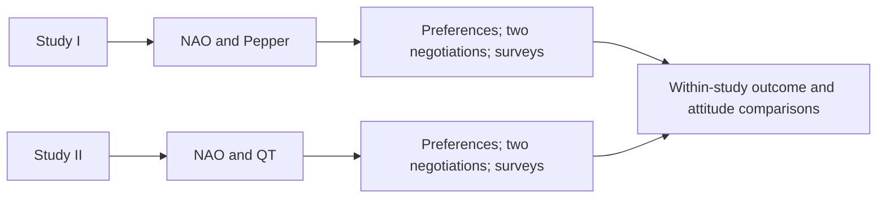

# You Look Nice, but I Am Here to Negotiate: The Influence of Robot Appearance on Negotiation Dynamics — [HRI 2024]

Mehmet Onur Keskin · Selen Akay · Ayşe Doğan · Berkecan Koçyiğit · Junko Kanero · Reyhan Aydoğan

[Paper](https://doi.org/10.1145/3610978.3640759) · [Explore the method](METHOD.md) · [Try the code](#try-it-yourself) · [Study guide](docs/protocol.md) · [Citation](#cite-the-paper)

[](https://github.com/monurkeskin/You-Look-Nice-but-I-Am-Here-to-Negotiate-HRI-2024/actions/workflows/tests.yml)

Two human–robot studies compare negotiation with NAO and Pepper, and with NAO and QT. They examine negotiation outcomes alongside first impressions and post-interaction attitudes, keeping the negotiating strategy common across robot conditions.

## Method

Participants rank their preferences for a holiday-planning task and negotiate twice. Robot order is counterbalanced. **NAO/Pepper and NAO/QT are separate study cohorts**, so their observations should not be treated as one interchangeable robot comparison.



## Study and findings

The paper reports differences in attitudes toward the robots, while its utility comparisons did not find significant differences between robot conditions. That separates an observed perception effect from the question of negotiation performance; a nonsignificant utility result is not an equivalence test. [Read the paper](https://doi.org/10.1145/3610978.3640759).

## What you can explore

Compare the two cohort configurations, inspect preference elicitation and review session records with robot order and domain identity preserved. The examples provide a starting point for studying appearance without mixing it with tactic changes.

| Explore | Start with | What it shows |
| --- | --- | --- |
| Separate cohorts | [CONFIGURATIONS.md](CONFIGURATIONS.md) | Choose NAO/Pepper or NAO/QT and the robot order. |
| Preference elicitation | [docs/protocol.md](docs/protocol.md) | Inspect participant ranking and conflicting robot preferences. |
| Interpretation | [docs/analysis.md](docs/analysis.md) | Keep domain, cohort and paired-session identity in the analysis. |

The configurations, method checks and study guides are specific to this paper. The shared [NEGOTIATOR framework](https://github.com/monurkeskin/NEGOTIATOR-IJCAI-2024) runs the negotiation,
participant/conductor views and session analysis. Its exact **2.0.0** revision is
pinned in [framework.json](framework.json); installation brings it in automatically.

The paper's holiday table and prose differ, and its illustrated weights differ from the legacy rank-to-weight conversion. The maintained configurations expose their choices in [METHOD.md](METHOD.md); they do not settle which files were used in each original cohort. Robot gestures and affect inputs also require the relevant lab setup.

## Try it yourself

Use Python 3.11 or 3.12 and Git. This first example runs locally without a robot,
camera or service account.

```bash
git clone https://github.com/monurkeskin/You-Look-Nice-but-I-Am-Here-to-Negotiate-HRI-2024.git
cd You-Look-Nice-but-I-Am-Here-to-Negotiate-HRI-2024
python3 -m venv .venv
source .venv/bin/activate
python -m pip install -r requirements.txt
python run.py --output demo-output
```

On Windows, create the environment with `py -3 -m venv .venv` and activate it with
`.venv\Scripts\Activate.ps1` in PowerShell.

Open **`demo-output/report/index.html`** to follow the example negotiation. The
output includes offers, utility trajectories, session records and exportable
figures. These are synthetic examples for exploring the software and method.
[Installation help](docs/compatibility.md).

### Read a calculation or open the study workspace

```bash
negotiator reproduce reproduction/method.json --output method-output
negotiator gui
```

In **New study → Import a paper or study configuration**, select
`configs/synthetic.json` for the demonstration, or `configs/protocol-nao-pepper-nao-first.json`
to inspect the paper's protocol template. The [study guide](docs/protocol.md)
explains the remaining protocol/asset requirements and device setup.

## Data and analysis

Participant records and recordings are not included. The examples use labeled
synthetic inputs so you can run the code and inspect its calculations. Recomputing
the human-study results requires authorized access to the original inputs and
the matching analysis procedure.

[Reproducibility guide](REPRODUCIBILITY.md) · [Paper-to-code map](paper-map.json) ·
[Analysis guide](docs/analysis.md)

## Build on the work

To change a paper condition, start with its configuration and add a small test
showing the intended behavior. Shared negotiation rules belong in NEGOTIATOR;
paper-specific profiles, protocols and result recipes belong here. The
[development guide](docs/development.md) walks through these boundaries and the
test-first workflow. [Contribution guide](CONTRIBUTING.md).

## Cite the paper

If you use this method or study design, please cite the associated paper:

```bibtex
@inproceedings{robotappearance2024,
  title = {You Look Nice, but I Am Here to Negotiate: The Influence of Robot Appearance on Negotiation Dynamics},
  author = {Keskin, Mehmet Onur and Akay, Selen and Doğan, Ayşe and Koçyiğit, Berkecan and Kanero, Junko and Aydoğan, Reyhan},
  year = {2024},
  doi = {10.1145/3610978.3640759},
  url = {https://doi.org/10.1145/3610978.3640759}
}
```

The [citation file](CITATION.cff) provides the paper as the preferred citation.
For software provenance, also record the version and [archived 2.0.0 artifact](https://doi.org/10.5281/zenodo.22729006).
When using the shared engine in new research, cite the
[NEGOTIATOR framework paper](https://doi.org/10.24963/ijcai.2024/1012).
GPL-3.0-only; original contributors and sources are credited in [NOTICE](NOTICE).
